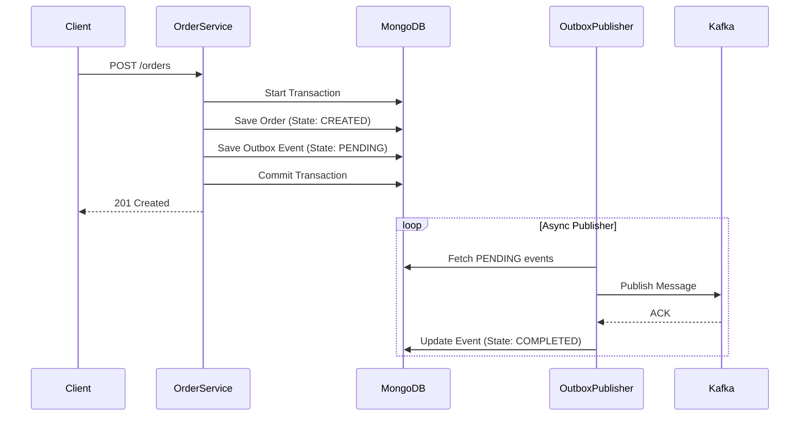
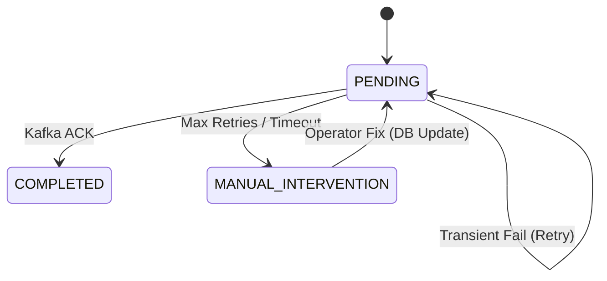

# ⚡ OrderPulse

> **Event-Driven Architecture** with Spring Boot 3.4, Kafka, and MongoDB.

OrderPulse is an implementation of a resilient microservice component designed to solve the **"Dual Write Problem"** in
distributed systems. It ensures data consistency between a Database and a Message Broker using the **Transactional
Outbox Pattern**, coupled with a robust "Safety Valve" mechanism for operational stability.

## 🏗 Architecture & Design Patterns

### 1. Transactional Outbox Pattern (Producer)

Instead of sending messages directly to Kafka (which risks inconsistency if the DB transaction fails), events are
persisted to a local `outbox` collection within the same ACID transaction as the business data.



### 2. Event Lifecycle & Safety Net (State Machine)

We employ a **Finite State Machine** for Outbox events. This prevents the system from indefinitely retrying "poison
pill" messages that could block the processing queue.

* **PENDING:** Event created inside the ACID transaction.
* **COMPLETED:** Successfully acknowledged by Kafka.
* **MANUAL_INTERVENTION:** 🛑 **The Circuit Breaker.**
    * Events are moved here if they fail max retries OR if they remain `PENDING` for too long (stuck).
    * Once in this state, the automated scheduler **ignores** them to preserve system stability.



---

## 🛡️ Resiliency Architecture: The "Safety Valve"

The core differentiator of OrderPulse is its **Dual-Scheduler Strategy** to handle edge cases (e.g., broker downtime,
serialization errors, data corruption).

### A. The Publisher Scheduler (Fast Loop)

* **Frequency:** High (e.g., every 5s).
* **Role:** Picks up fresh `PENDING` events and attempts to send them to Kafka.

### B. The Stuck Event Monitor (Slow Loop)

* **Frequency:** Low (e.g., every 5 mins).
* **Role:** Detects "Zombies". It scans for events that have been stuck in `PENDING` longer than the safety threshold (
  e.g., 10 minutes) and automatically promotes them to `MANUAL_INTERVENTION`.
* **Why:** This prevents the primary Publisher from choking on a single broken event forever.

### 🚨 Operational Playbook (How to fix `MANUAL_INTERVENTION`)

When an event enters this state, it requires human decision.

**1. Diagnose**
Find the quarantined events and check the `error_log` field.

```javascript
db.outbox.find({status: "MANUAL_INTERVENTION"})
```

**2. Resolution**

* **Scenario A (Infrastructure Glitch):** If Kafka was down, no data fix is needed.
* **Scenario B (Data Corruption):** Manually correct the payload in the MongoDB document.

**3. Replay**
"Unblock" the event by resetting it to `PENDING`. The Publisher Scheduler will pick it up in the next cycle.

```javascript
db.outbox.updateOne(
    {_id: ObjectId("YOUR_EVENT_ID")},
    {
        $set: {
            status: "PENDING",
            attempts: 0,
            lastModified: new Date()
        }
    })
```

---

## 🛠 Tech Stack

* **Core:** Java 21, Spring Boot 3.4
* **Messaging:** Apache Kafka (KRaft mode), Spring Cloud Stream
* **Database:** MongoDB 7.0 (Replica Set enabled for Transactions)
* **Testing:** JUnit 5, Testcontainers, Awaitility
* **Tooling:** Docker Compose, Lombok, Jackson

---

## 🚀 How to Run

### Prerequisites

* Java 21+
* Docker & Docker Compose

### 1. Start Infrastructure

Start Kafka and MongoDB containers:

```bash
docker-compose up -d
```

### 2. Run Application

```bash
./mvnw spring-boot:run
```

The application will start on port `8081` with context path `/order-pulse`.

---

## 🧪 API Usage

### Create an Order

This endpoint saves the order and eventually triggers a Kafka message.

```bash
curl -X POST http://localhost:8081/order-pulse/orders/create \
-H "Content-Type: application/json" \
-d '{
"customerName": "John Wick",
"productSku": "PENCIL-001",
"amount": 1500.00
}'
```

**Expected Output (Logs):**

1. `🛡️ Processing order...`
2. `✅ Order created and Outbox event staged successfully.`
3. `✅ Event processed. ID: ...` (Async Scheduler)
4. `📦 [Warehouse] Received Event...` (Consumer)

---

## 🛡️ Error Handling (RFC 7807)

The API implements **Problem Details for HTTP APIs**. Critical errors return structured responses:

```json
{
  "type": "urn:orderpulse:error:serialization",
  "title": "Event Serialization Error",
  "status": 500,
  "detail": "Failed to serialize Outbox Event...",
  "timestamp": "2026-01-10T12:00:00Z"
}
```

---

## 🐳 Integration Testing

This project uses **Testcontainers** for true End-to-End testing. It spins up real Kafka and MongoDB instances, runs the
full flow (including the scheduler), and tears them down.

Run tests via Maven:

```bash
./mvnw test
```

---

## 📂 Project Structure

```text
src/main/java/com/nsdev/orderpulse
├── domain          # Core Business Logic (Hexagonal style)
│   ├── model       # Entities
│   ├── service     # Transactional Services
│   └── event       # Domain Events
├── infra
│   └── outbox      # Outbox Pattern Implementation
│       ├── model       # Outbox Entity & Enums
│       ├── repository  # Mongo Repository
│       └── scheduler   # Publisher & Stuck Event Monitor
├── warehouse       # Consumer Module (Simulating external service)
└── web             # REST Controllers & Global Exception Handling
```